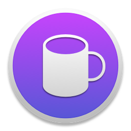
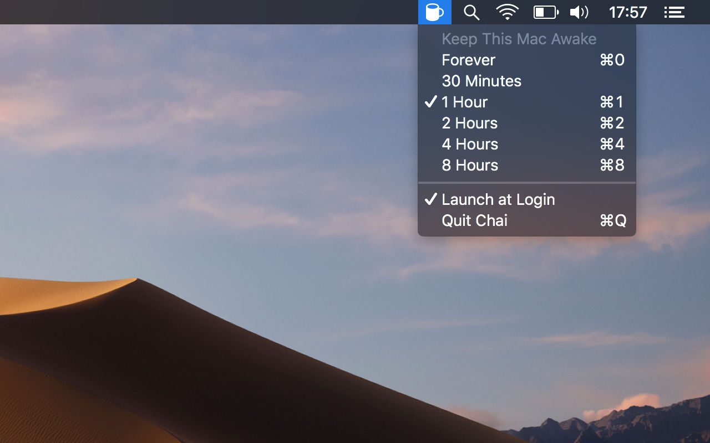

# Theine

_Don't let your Mac fall asleep, like a sir_

--------------------------------------------------------------------------------

## Installation

    brew cask install theine

## Don't We Have Caffeine Already?

Theine is better than [Caffeine](http://lightheadsw.com/caffeine/) in a number of ways:

* It's open source, we have nothing to hide.
* The monochrome icon adapts nicely to light and dark themes. It's ready for Mojave.
* Uses [power assertions][IOPMLib] to keep your Mac awake.
* It runs in the [sandbox][sandbox] to keep your Mac secure.
* Tea is supposedly better than coffee.

## Icons

Icons are licensed from [Glyphish](http://glyphish.com) and cannot be used outside this project.

[IOPMLib]:
https://developer.apple.com/library/mac/documentation/IOKit/Reference/IOPMLib_header_reference/

[sandbox]:
https://developer.apple.com/library/mac/documentation/Security/Conceptual/AppSandboxDesignGuide/AboutAppSandbox/AboutAppSandbox.html
