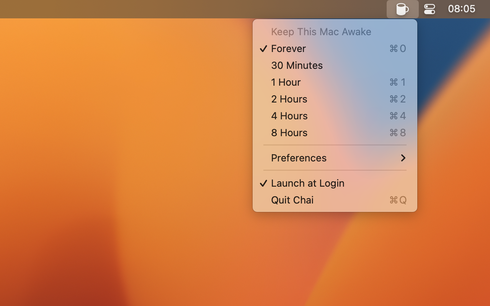

# Chai

_Don't let your Mac fall asleep, like a sir_

--------------------------------------------------------------------------------

## Installation

> [!NOTE]
>
> Chai fails Gatekeeper checks and will be removed from official Homebrew Casks on 2026-09-01. It
> must be installed from the tap:

    brew install lvillani/tap/chai

## How Does It Look?

## Don't We Have Caffeine Already?

Chai is better than [Caffeine](http://lightheadsw.com/caffeine/) in a number of ways:

* It is open source, so we have nothing to hide.
* It uses [power assertions][IOPMLib] to keep your Mac awake.
* It runs in the [sandbox][sandbox] to keep your Mac secure.

## Icons

Icons are licensed from [Glyphish](http://glyphish.com) and cannot be used outside this project.

[IOPMLib]:
https://developer.apple.com/library/mac/documentation/IOKit/Reference/IOPMLib_header_reference/

[sandbox]:
https://developer.apple.com/library/mac/documentation/Security/Conceptual/AppSandboxDesignGuide/AboutAppSandbox/AboutAppSandbox.html
